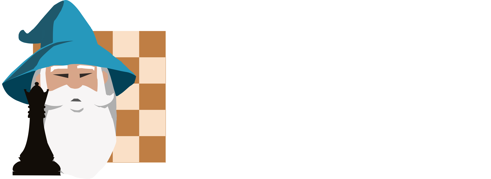

# Hawkins - Chess AI

"Hawkins" is an open-source, competitive Chess AI powered by Minimax Search algorithm. It makes use of various optimization techniques, mostly extensions of alpha-beta pruning and other traditional chess engine methods. It comes with its own GUI (which was heavily inspired by [Nick Zuber's](https://github.com/nickzuber/chs) board design) and many levels of difficulty.

# Engine Performance

Hawkins plays at a really high-level, even when compared to the strongest AIs ever written in Python. In this particular game, Hawkins went head to head with Stockfish's fifth level on lichess (rated ~2000 ELO), and won after dozens of well-crafted moves.

**Stockfish vs Hawkins, 0-1**
